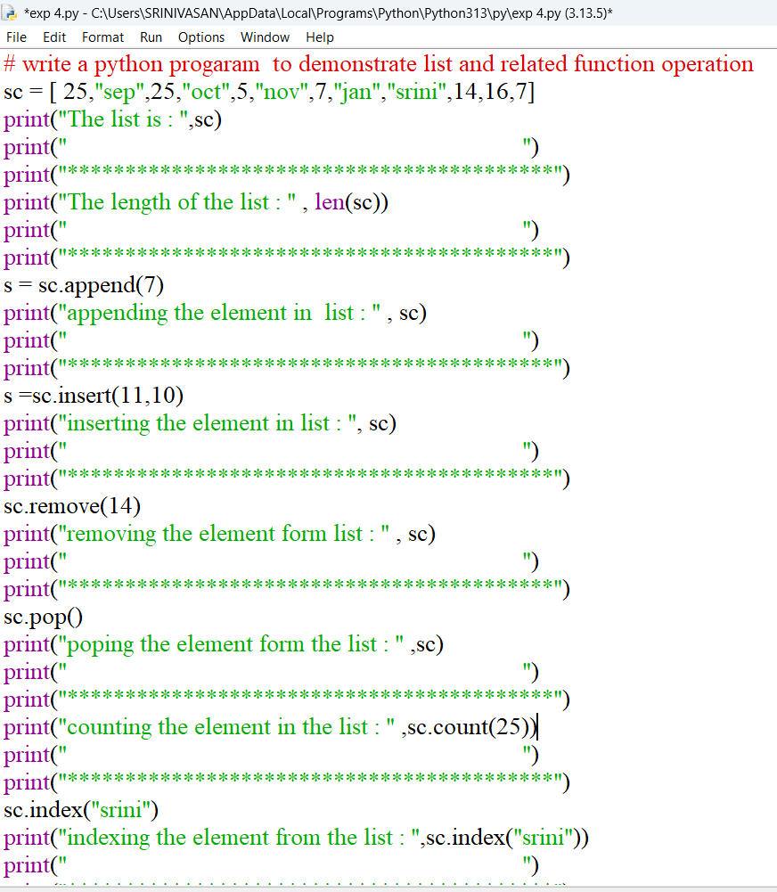
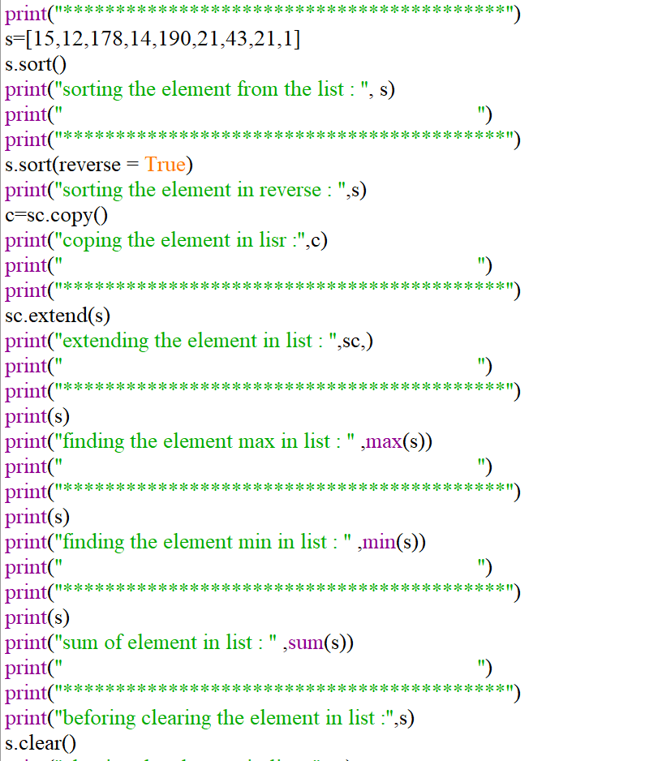
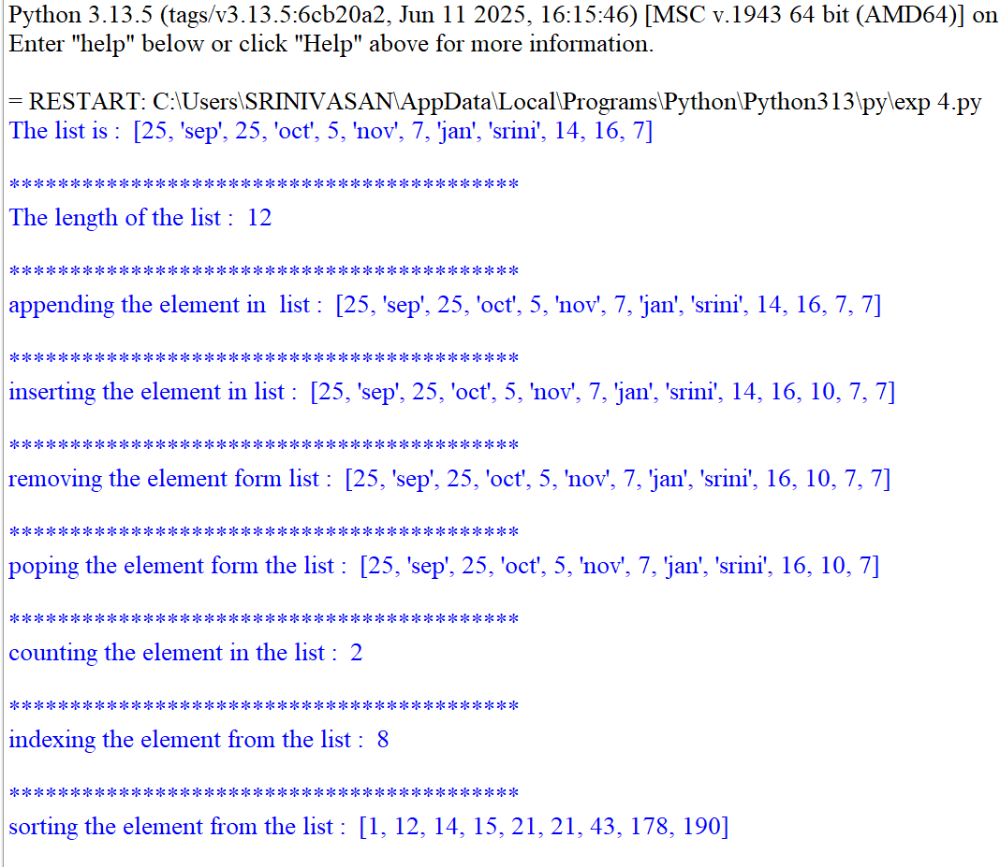
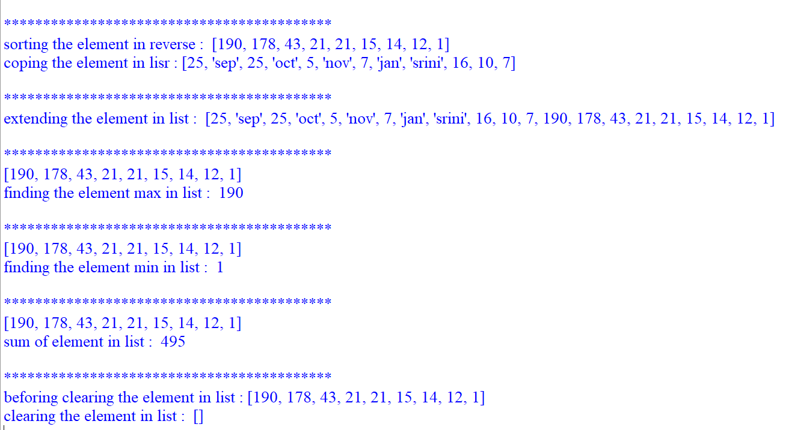

# PYTHON-LAB-EXPERIMENT-4
PYTHON PROGRAMMING LAB EXPERIMENT 

## Aim

To write a Python program to demonstrate list and related list functions/operations such as append(), insert(), remove(), pop(), count(), index(), sort(), copy(), extend(), max(), min(), sum(), and clear().

## Algorithm

1.Start the program.

2.Create a list containing different elements.

3.Display the list and find its length using len().

4.Add an element at the end using append().

5.Insert an element at a specific position using insert().

6.Remove an element using remove().

7.Remove the last element using pop().

8.Count the occurrence of an element using count().

9.Find the position of an element using index().

10.Create another numeric list.

11.Sort the list in ascending order using sort().

12.Sort the list in descending order using sort(reverse=True).

13.Copy the list using copy().

14.Combine two lists using extend().

15.Find the maximum and minimum values using max() and min().

16.Find the sum of elements using sum().

17.Remove all elements using clear().

18.Stop the program.

## Source code

## output

